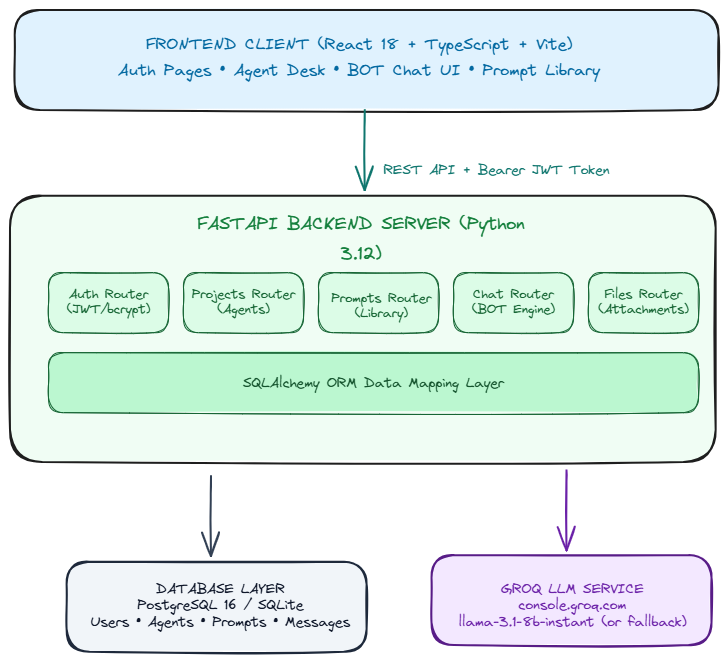

# Chatbot Platform (AgentDesk)

A minimal, full-stack Chatbot Platform providing user authentication, multi-tenant AI project/agent management, prompt libraries, chat interfaces powered by **[Groq AI](https://console.groq.com)**, and reference file uploads.

---



---

## Quick Testing Setup

1. **Get Free Groq API Key**: Sign up at **[https://console.groq.com](https://console.groq.com)** and create an API key.
2. **Configure `.env`**:
   ```bash
   cp .env.example .env
   ```
   Set `GROQ_API_KEY=your_key_here` in `.env`.
3. **Run with Docker**:
   ```bash
   docker compose up --build -d
   ```
4. **Access App**:
   - Web Application: **[http://localhost:3000](http://localhost:3000)**
   - API Docs: **[http://localhost:8000/docs](http://localhost:8000/docs)**

---

## Features & Requirements Coverage

### Functional Requirements
- **Authentication**: Email & password registration and login backed by JWT bearer tokens and bcrypt password hashing.
- **User Accounts**: Multi-user support with user-scoped isolation for all projects and conversations.
- **Projects / Agents**: Create, list, configure (system prompts), update, and delete AI agents per user.
- **Prompts Library**: Store, list, and associate reusable prompt templates with each agent.
- **Chat Interface**: Interactive chat workspace powered by **[Groq API](https://console.groq.com)** (`llama-3.1-8b-instant`) with automatic local offline fallback. Assistant responses are clearly identified under the `BOT` role.
- **File Attachments**: Upload and attach context files per project with size validation.

### Non-Functional Requirements
- **Scalability**: Stateless FastAPI backend architecture with SQLAlchemy connection pooling, horizontal scaling support, and user-isolated database records.
- **Security**: Passwords hashed with bcrypt, JWT token expiration, CORS origin filtering, and ORM SQL-injection protection. Secrets managed securely via `.env`.
- **Extensibility**: Modular router/service design ready for vector store RAG, streaming, and analytics.
- **Performance**: Asynchronous non-blocking LLM requests, Vite-bundled React SPA frontend, and database indexing.
- **Reliability**: Structured HTTP error codes, rate limiting, and graceful fallback to offline mode if API keys are missing.

---

## Local Development (Without Docker)

### Prerequisites
- Python 3.12+
- Node.js 18+ / 20+

### Backend Setup
```bash
cd backend
python -m venv .venv
# Windows: .venv\Scripts\activate | Linux/macOS: source .venv/bin/activate
pip install -r requirements.txt

# Start backend server
uvicorn app.main:app --reload --port 8000
```

### Frontend Setup
```bash
cd frontend
npm install
npm run dev
```
Open [http://localhost:5173](http://localhost:5173).

---

## API Summary

| Method | Endpoint | Description |
|--------|----------|-------------|
| POST | `/api/auth/register` | Create account & return JWT |
| POST | `/api/auth/login` | Login & return JWT |
| GET | `/api/auth/me` | Fetch current user |
| GET / POST | `/api/projects` | List / create agents |
| GET / PATCH / DELETE | `/api/projects/{id}` | Manage agent details |
| GET / POST | `/api/projects/{id}/prompts` | Manage prompt library |
| POST | `/api/projects/{id}/chat` | Send chat message to BOT |
| GET | `/api/projects/{id}/chat/conversations` | List agent chat sessions |
| POST / DELETE | `/api/projects/{id}/files` | Upload / delete project files |

---

## Architecture & Design

Detailed architecture diagrams, data models, and flow specifications are available in [docs/ARCHITECTURE.md](docs/ARCHITECTURE.md).
